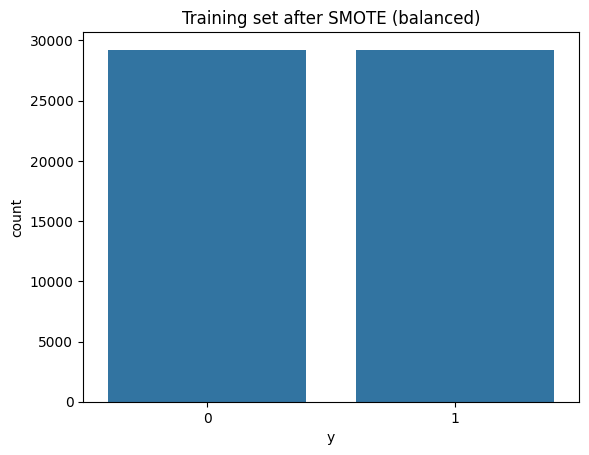
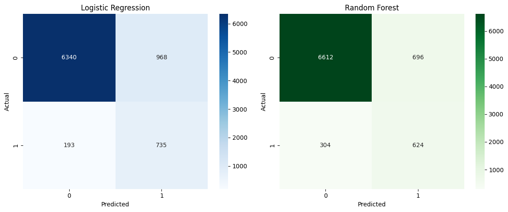

# 🏦 Bank Marketing — End-to-End ML Pipeline

Predicting whether a bank client will subscribe to a term deposit, using the UCI Bank Marketing dataset. The project walks through a complete, leakage-aware machine learning workflow, from raw data download to model evaluation.

[](https://colab.research.google.com/github/MMujtabaX/bank-marketing-ml-pipeline/blob/main/E2EMLPipeline.ipynb)


## 📌 Overview

The dataset comes from direct phone marketing campaigns run by a Portuguese bank. It has 41,188 records and 20 features. The target is highly imbalanced: only about 11% of clients subscribed. The goal is to build a classifier that finds likely subscribers without being fooled by that imbalance.

## 🔄 Pipeline

| Step | Stage | Details |
|------|-------|---------|
| 1 | Data acquisition | Downloads and extracts nested ZIPs directly from the UCI repository |
| 2 | EDA | Inspects the schema and summary statistics; target imbalance is 88.7% / 11.3% |
| 3 | Cleaning | Removes duplicates; treats `unknown` as missing; imputes with the median (numeric) or `missing` (categorical) |
| 4 | Train-test split | Stratified 80/20 split, done **before** preprocessing to prevent data leakage |
| 5 | Encoding & scaling | `OneHotEncoder` + `StandardScaler` via `ColumnTransformer`, fit on the training set only |
| 6 | Feature selection | `SelectKBest` (chi-square) keeps the top 15 features |
| 7 | Dimensionality reduction | PCA to 10 components |
| 8 | Class balancing | SMOTE, applied to the training set only; the test set keeps its real-world distribution |
| 9 | Modeling | Logistic Regression and Random Forest |
| 10 | Evaluation | Classification report, ROC-AUC and confusion matrices |

## 📊 Results

Evaluated on an untouched, imbalanced test set of 8,236 samples.

| Model | Accuracy | Precision (Yes) | Recall (Yes) | F1 (Yes) | ROC-AUC |
|-------|----------|-----------------|--------------|----------|---------|
| Logistic Regression | 0.86 | 0.43 | **0.79** | 0.56 | 0.896 |
| Random Forest | **0.88** | **0.47** | 0.67 | 0.56 | **0.902** |

**Takeaway:** Random Forest has slightly better overall discrimination (ROC-AUC). Logistic Regression catches far more actual subscribers (79% recall vs 67%). For a marketing team, where a missed customer usually costs more than an extra phone call, Logistic Regression is the more practical choice.

### Target distribution


### Confusion matrices


## 🚀 Getting Started

```bash
git clone https://github.com/MMujtabaX/bank-marketing-ml-pipeline.git
cd bank-marketing-ml-pipeline
pip install -r requirements.txt
jupyter notebook E2EMLPipeline.ipynb
```

Or click the **Open in Colab** badge above. The notebook downloads the dataset automatically, so no manual setup is needed.

## 📁 Project Structure

```
├── E2EMLPipeline.ipynb   # Full pipeline notebook
├── assets/               # Plots used in this README
├── requirements.txt
└── README.md
```

## ⚠️ Limitations & Future Work

- **`duration` feature:** call duration is only known *after* the call ends, so it inflates results for a real pre-call prediction model. A realistic next version should drop it.
- Replace chi-square on absolute scaled values with `mutual_info_classif`, which suits mixed feature types better.
- Try gradient boosting (XGBoost or LightGBM) and hyperparameter tuning.
- Tune the decision threshold to trade off precision against recall.

## 📚 Dataset

Moro, S., Cortez, P., & Rita, P. (2014). *A Data-Driven Approach to Predict the Success of Bank Telemarketing.* [UCI Machine Learning Repository](https://archive.ics.uci.edu/dataset/222/bank+marketing)

## 👤 Author

**Muhammad Mujtaba Khan Suri** — CS @ UBIT, University of Karachi
[GitHub](https://github.com/MMujtabaX)
